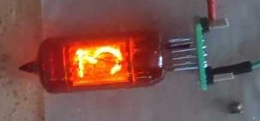

# Six digit nixie clock

I got my hands on handful of different nixie tubes when we were moving out some old wardrobes at CTU. I thought
this would be just a small project, but well... Anyway it turned out to be a max 6 digit (+2 dividers)
USB powered nixie clock. It is controlled by RP2040.

## Table of Contents

- [Hardware](#hardware)
  - [Z570M socket](#z570m-socket)
  - [HV power supply board](#hv-power-supply)
  - [Digits and HV5530 board](#digits-and-HV5530-board)
  - [Control board](#control-board)
- [Software](#software)

## Hardware
This project contains 4 PCBs (3x 2 layer, 1x 4 layer) in total. They are supposed to be stacked on top of each other using M3 spacers. 

### Z570M socket
This pcb is just a socket for the [Z570M](https://www.tube-tester.com/sites/nixie/data/z570m/z570m.htm).
There were original plastic sockets produced for them, but I don't have one. When soldering the tube, it is better
to cool down the contacts near the tube to avoid possible vacuum leak. It can be done with a wet napkin, just
be careful to not dissolve the red coating.

    
    

### HV power supply
This board is a boost converter powered by MAX1771. The PCB is modified from [Nick de Smith](https://nick.desmith.net) design. It generates 150-220V from 12V input for the tubes. Set voltage by trimmer
on the board. It is not galvanically isolated, so be careful to not get shocked.

### Digits and HV5530 board
This is basically a holder for the tubes with a [HV5530](https://ww1.microchip.com/downloads/aemDocuments/documents/OTH/ProductDocuments/DataSheets/20005851A.pdf) soldered on.
I personally do not like time multiplexing nixies as it causes more wear on the cathodes. One HV5530 can drive 
up to 3 tubes and 2 dividers. 

### Control board
The digital part consists of a RP2040, DS3231 for RTC, and DS18B20 for temperature sensing. The non used pins of RP2040
are fanned out to a standard pin header for additions that will be surely found out just after the design is completed :D 
To lower the already high step-up ratio, the TPS2573 requests 12V from USB PD charger. RP2040 is also programmed using
that USB-C. This is the only 4 layer board in the project.

### Software
WIP
